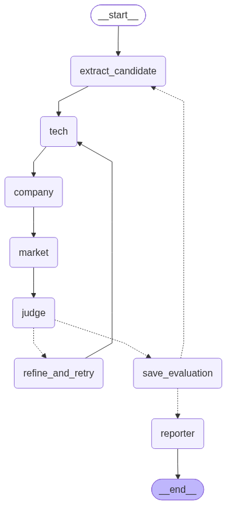
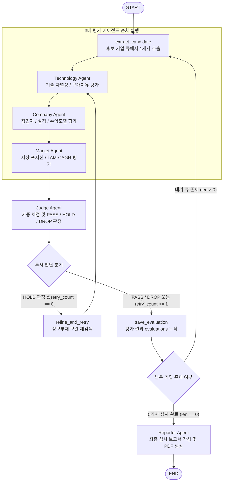

# AI Startup Investment Evaluation Agent

본 프로젝트는 **피지컬 AI 및 자율주행·로보틱스(Physical AI / Robotics)** 스타트업에 대한 투자 가능성을 다각도로 자동 평가하고, VC(벤처캐피탈) 투자 심의 기준에 부합하는 종합 투자 심사 보고서를 자동 생성하는 **Agentic RAG 기반 멀티 에이전트 파이프라인** 실습 프로젝트입니다.

---

## Overview
- **Objective** : 비상장 피지컬 AI 스타트업 5개사(트위니, 뉴빌리티, 서울로보틱스, 마스오토, 엑스와이지)의 **기술성, 기업 역량, 시장성, 재무 실적** 등을 종합 분석하여 100점 만점 스코어카드 및 과락(Cutoff) 규칙에 따른 투자 적합성(PASS / HOLD / DROP) 자동 심사
- **Method** : **LangGraph StateGraph** 기반 순차 평가 파이프라인 + **Agentic RAG** (메타데이터 필터링 기반 검색) + **조건부 자율 재심사 루프(Refine & Retry Loop)**

---

## Features
- **체계적인 RAG 전처리 및 임베딩 파이프라인**: 스타트업 기술 문서, IR 프로필, 뉴스, 공시자료, 공공기관(KIRIA, SPRI) 산업 리포트 등 이종 문서 자동 파싱 및 메타데이터(`company`, `doc_type`, `url`, `date`) 자동 태깅
- **3대 전문 평가 에이전트의 다각도 심사**:
  - **기술성(Tech)**: 기술 차별성, 특허 보유 수, 기술성숙도(TRL), 고객 구매 이유(도입 효과) 분석
  - **기업 역량(Company)**: 창업팀 전문성, 매출 성장성, 반복 매출 수익모델(BM) 분석 및 제3자 공시 데이터 교차 검증
  - **시장성(Market)**: 산업 리포트 기반 시장 규모(TAM), 연평균 성장률(CAGR), 진입장벽 및 규제 환경 분석
- **Bessemer Checklist & VC 스코어카드 기반 정량 판정**: 7개 평가 항목 가중 채점(100점)과 2대 핵심 과락 규칙(기술 차별성 또는 창업자 1점 이하 시 즉시 DROP) 적용
- **자율 조건부 루프 (Refine & Retry)**: HOLD 판정(60점 이상 ~ 75점 미만) 시 정보 부재 항목을 식별하여 RAG 재검색 및 점수 보완을 수행하는 루프 자동 분기 (최대 1회)
- **정식 규격 투자 심사 보고서 자동 컴파일**: 5개사 통합 스코어카드 표, 1위 추천 기업 심층 분석, 보류 기업 요약, 정보 부재 및 리스크 분석, 원문 링크(URL)가 포함된 마크다운 보고서 생성 및 **제출용 PDF 자동 변환**

---

## Tech Stack
- **Framework** : LangGraph, LangChain
- **LLM / Generator** : `gpt-4o` (최종 보고서 작성), `gpt-4o-mini` (평가 에이전트)
- **LLM / Judge** : `gpt-4o-mini` (판정 사유 추론) + Python Rule-based Code (가중 채점 및 과락 판정)
- **Retrieval** : FAISS (Dense VectorStore with Metadata Filtering)
- **Embedding** : `BAAI/bge-m3` (Open-source Multi-lingual Dense Embedding)
- **Export Engine** : `markdown-pdf` (MuPDF 엔진 기반 마크다운 to PDF 자동 컴파일)

---

## Agents

| 에이전트명 | 담당자 | 담당 데이터 | 평가 항목 및 주요 역할 | 비중 |
| :--- | :---: | :---: | :--- | :---: |
| **Technology Agent**<br>(기술성 평가 에이전트) | 우성윤 | 트위니 자료 | • 기술 차별성 및 특허 (TRL, 등록 특허, 독점 기술)<br>• 구매이유 (고객사 도입 효과 및 비용 절감 수치 검증) | 25%<br>10% |
| **Company Agent**<br>(기업 역량 평가 에이전트) | 이진서 | 뉴빌리티 자료 | • 창업자 및 팀 역량 (학력, 경력, 전문성)<br>• 실적 (매출 성장률, 주요 고객사)<br>• 수익모델 (BM, 구독/유지보수 등 반복 매출 구조) | 20%<br>10%<br>10% |
| **Market Agent**<br>(시장성 평가 에이전트) | 김지훈 | 서울로보틱스 자료 | • 시장 내 포지션 및 진입장벽 (경쟁 구도, 대기업 협력)<br>• 시장성 (글로벌/국내 TAM, CAGR, 정책 및 규제 환경) | 15%<br>10% |
| **Judge Agent**<br>(투자 판단 에이전트) | 김영제 | 마스오토 자료 | • 7개 항목 점수 종합 가중 합산 (100점 만점)<br>• 과락 검증 (기술차별성/창업자 1점 이하 시 DROP)<br>• 판정 (PASS ≥ 75점 / HOLD 60~74점 / DROP < 60점)<br>• LLM 기반 판정 사유 및 정보 부재 항목 도출 | 판정 |
| **Reporter Agent**<br>(보고서 생성 에이전트) | 서승현 | 엑스와이지 자료 | • 5개사 종합 평가 결과 바탕 최종 투자 심사 보고서 작성<br>• 5×7 종합 스코어카드 매트릭스 표 및 원문 링크(URL) 정리<br>• 마크다운 보고서 및 정식 제출 규격 PDF 파일 자동 변환 저장 | 종합 |

---

## Architecture

<p align="center">
  
</p>

<details>
<summary><b>📐 상세 파이프라인 Mermaid 다이어그램 펼치기</b></summary>



</details>

---

## Directory Structure

```text
├── data/                                 # RAG 지식 베이스 문서 풀
│   ├── companies/                        # 5개 스타트업별 프로필, 기술문서, 재무, 공시 자료
│   │   ├── twinny/                       # 트위니 (자율주행 물류 로봇)
│   │   ├── neubility/                    # 뉴빌리티 (실외 자율주행 배달 로봇)
│   │   ├── seoulrobotics/                # 서울로보틱스 (3D 라이다 인프라 자율주행)
│   │   ├── marsauto/                     # 마스오토 (카메라 E2E AI 화물 자율주행)
│   │   └── xyz/                          # 엑스와이지 (서비스 로봇 및 로봇 자동화)
│   └── market/                           # 산업 분석 공통 리포트 (KIRIA 로봇 보고서, SPRI AI 보고서 등)
├── src/                                  # 시스템 핵심 파이프라인
│   ├── agents/                           # 평가 기준별 에이전트 모듈
│   │   ├── tech.py                       # 기술성 평가 에이전트
│   │   ├── company.py                    # 기업 역량 평가 에이전트
│   │   ├── market.py                     # 시장성 평가 에이전트
│   │   ├── judge.py                      # 투자 판단 에이전트
│   │   └── reporter.py                   # 보고서 생성 및 PDF 변환 에이전트
│   ├── state.py                          # 15개 공유 필드 GraphState 정의
│   ├── vectorstore.py                    # BAAI/bge-m3 임베딩 및 FAISS 벡터스토어 빌더
│   └── graph.py                          # StateGraph 노드, 조건부 엣지, 파이프라인 조립
├── prompts/                              # 에이전트별 특화 프롬프트 템플릿
│   ├── tech_prompt.txt                   # 기술성 심사 프롬프트
│   ├── company_prompt.txt                # 기업 역량 심사 프롬프트
│   ├── market_prompt.txt                 # 시장성 심사 프롬프트
│   ├── judge_prompt.txt                  # 투자 판단 프롬프트
│   └── report_prompt.txt                 # 최종 보고서 작성 프롬프트
├── outputs/                              # 최종 산출물 (마크다운 및 PDF 보고서)
├── app.py                                # 메인 실행 스크립트
├── requirements.txt                      # 환경 의존성 목록
└── README.md                             # 프로젝트 설명 문서
```

---

## Usage

### 1. 환경 설정 및 가상환경 활성화
```bash
# 가상환경 생성 및 활성화
python -m venv .venv
source .venv/bin/activate  # Windows: .venv\Scripts\activate

# 의존성 패키지 설치
pip install -r requirements.txt
```

### 2. 환경변수(.env) 설정
프로젝트 루트 디렉토리에 `.env` 파일을 생성하고 OpenAI API 키를 입력합니다:
```env
OPENAI_API_KEY=your_openai_api_key_here
```

### 3. 전체 파이프라인 실행
```bash
python app.py
```
* 5개 스타트업 순차 심사 → 조건부 재심사 루프 → 최종 종합 투자 심사 보고서가 자동 생성되어 `outputs/` 디렉토리에 PDF 파일로 저장됩니다.

---

## Contributors

| 팀원 | 담당 역할 및 기여 내용 |
| :---: | :--- |
| **우성윤** | • **기술성 평가 에이전트(`src/agents/tech.py`)** 및 **트위니 자료** 전담<br>• C.3 Scorecard 기준 기술성 평가 프롬프트 엔지니어링 (`prompts/tech_prompt.txt`)<br>• RAG 메타데이터 파이프라인 및 원문 URL 연동 |
| **이진서** | • **기업 역량 평가 에이전트(`src/agents/company.py`)** 및 **뉴빌리티 자료** 전담<br>• 기업 분석 프롬프트 작성 및 공시·감사보고서 기반 제3자 근거 교차 검증 로직 구현<br>• 스타트업 프로필 및 재무 데이터 전처리 |
| **김지훈** | • **시장성 평가 에이전트(`src/agents/market.py`)** 및 **서울로보틱스 자료** 전담<br>• 공통 시장 산업 리포트(KIRIA, SPRI) 전용 RAG 검색기 및 문서 내 원문 인용 검증기 구현<br>• 시장성 평가 프롬프트 엔지니어링 (`prompts/market_prompt.txt`) |
| **김영제** | • **투자 판단 에이전트(`src/agents/judge.py`)** 및 **마스오토 자료** 전담<br>• 7개 평가 항목 가중 채점(100점) 알고리즘 및 2대 과락(Cutoff) 규칙 구현<br>• 심사 사유 추론 프롬프트 엔지니어링 (`prompts/judge_prompt.txt`) 및 State 누적 연동 |
| **서승현** | • **보고서 생성 에이전트(`src/agents/reporter.py`)** 및 **엑스와이지 자료** 전담<br>• 최종 VC 투자 심사 보고서 종합 프롬프트 엔지니어링 (`prompts/report_prompt.txt`)<br>• `markdown-pdf` 기반 최종 마크다운 보고서의 제출 규격 PDF 자동 변환 및 산출물 저장 연동 |

